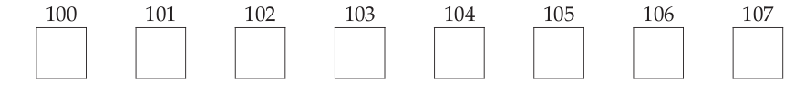
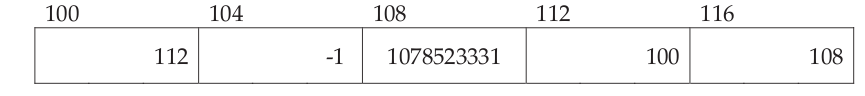
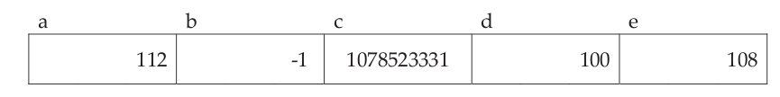
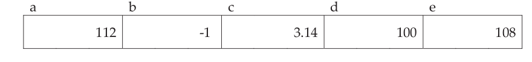
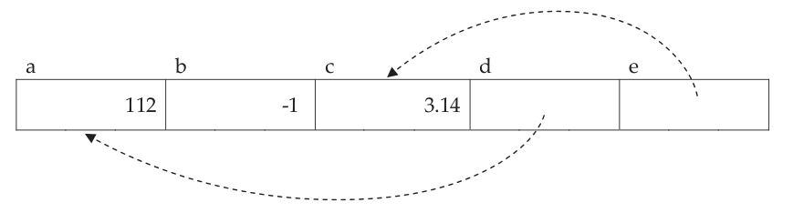
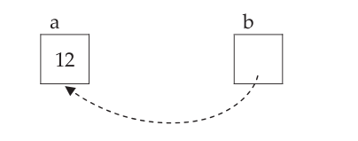

# Punteros

## Memorias y Direcciones

La memoria de las computadoras están compuestas de millones de `bits`, cada uno capaz de tener el valor de 0 o de 1 agrupados como una unidad para  almacenar un rango mayor de valores.



Cada localización es llamado un `byte` y cada uno contiene los `bits`  necesarios para almacenar un caracter.  Por ejemplo cada `byte` contiene 8 `bits`, que pueden almacenar enteros desde el 0 al 255 o enteros con signos `unsigned` desde -128 a 127.
Cada `byte` es identificado por una ` dirección`, que representan los números encima de las cajas.

- Cada localización en memoria es identificado por una única dirección.
- Cada localización en memoria contiene un valor.


## Dirección y Contenido

El  siguiente gráfico muestra 5 valores enteros, cada uno ocupando una cantidad de `bytes`. Si recuerdas las direcciones donde se almacena algun valor, puedes usar esas direcciones para recuperar su valor.



Los lenguajes de programación de alto nivel proporcionan la habilidad de referirse  a la localización de memoria por nombres que por direcciones y esos nombres son llamados `variables`.



## Valores y sus tipos

Veamos las declaraciones para las variables del gráfico anterior

```c
int a = 112, b = -1;
float c = 3.14;
int *d = &a;
float *e = &c;
```

Si `c` es un entero, por que aparece como `float`?.

La respuesta es que la variable contiene una secuencia de 0 y 1 que pueden ser interpretados con distinto formato y interpretaciones segun el sistema que maneja  estos `bits`. Es decir esta secuencia de `bits` pueden ser interpretados como enteros o punto flotante dependiendo de la manera que son usados. Si instrucciones aritméticas de enteros son usadas, el valor es interpretado como entero. Si instrucciones de punto flotante son usadas, es un número punto flotante.

Este hecho conduce a una conclusión importante: `el tipo de un valor no puede ser determinado simplemente examinando bits`. Para determinar este tipo y por tanto su valor se debe conocer como este valor es usado en el programa.

Sea este  número en binario

```c
01100111011011000110111101100010
```

y  los siguiente tipos de datos, entonces el valor deberia ser interpretado de  5 formas diferentes .

```c
   Tipo				       Valores
Entero 32-bits		    1 735 159 650
Entero 16-bits          26 476 seguido por 28 514
4 caracteres			glob
Punto flotante		    1.11653x10^24
Instrucciones maquina    beg .+110 seguido por b1e.+102
```
El tipo de un valor no es algo inherente al valor, sino que depende de como es usado. Es por ello que declarar `c` como `float` causa que el compilador genere instrucciones de punto flotante.


## L- Valor y R-Valor

Un `L-Valor` es algo que puede aparecer en el lado izquierdo de un signo igual. Un `R-valor` es algo que puede aparecer en el lado derecho de un signo igual. Por ejemplo

```c
i = j + 12;
```

`i` es un `L-valor` por que identifica un lugar donde el resultado puede ser almacenado. `j + 12` es un `R-valor`por que designa un valor.

Esta asignación es ilegal

```c
j + 12 = i;
```

Notemos que cuando el computador evalua `j +12` el resultado debe existir en alguna parte en la máquina. Sin embargo, no hay manera de que el  programador puede predecir donde el resultado estará o referirse a la misma localización más tarde. En consecuencia, esta expresión no es un `L-valor`. Las constante literales no son `L-valores` por la misma razón.

Esto suena como si las variables solo  se pueden usar como `L-valor`, y las expresiones no puede ser `L-valor`, pero esta afirmación no es del todo exacto. El  `L-valor`en la asignación a continuación es una expresión:

```c
int a[30];
...
a[b + 10] = 0;
```

Los subíndices son  de hecho un operador de manera que el constructor de la izquierda es una expresión, sin embargo, es un legítimo `L-valor`, ya que identifica una ubicación específica que podemos referirnos  más tarde en el programa. Otro ejemplo seria:

```c
int a, *pi;
...
pi = &a;
*pi = 20;
```

El segundo asignamiento  es donde está la acción: el valor de la izquierda es claramente una expresión, sin embargo, es un `L-valor`. ¿Por qué?. El valor en el  puntero `pi` es la dirección de una localizacion  específica en la memoria, y el operador `*` dirige a la máquina a esa ubicación. Cuando se utiliza como un `L-valor`, esta expresión especifica la ubicación a ser modificado. Cuando se utiliza como un `R-valor`, se obtiene el valor  almacenado en esa ubicación.

## Contenido de una variable Puntero

Las variables `d` y `e` fueron declaradas como punteros y son inicialiazadas con la dirección de otra variable. La inicialización es hecha con el operador `&`, que produce la `dirección de memoria` de su operando.



Veamos las expresiones involucrando estas variables

```c
int a = 112, b = -1;
float c = 3.14;
int *d = &a;
float *e = &c;
```

El valor de  `a` es 112, el valor de `b` es -1 y el valor de `c` es 3.14. El valor de `d` es 100  y el valor de `e` es 108. El hecho de que `d` y `e` son declarados como punteros no cambia  como esas expresiones son evaluadas; el valor de una variable es el número almacenado en la localización de memoria asignada a la variable incluso para las variables punteros.


## Operador indirección

El proceso de seguir un puntero a la ubicación a la que apunta es llamado `indirección` o `dereferenciando el puntero`. La operación que lleva a cabo la `indirección` es `*`.

```
Expresión			R-Valor 			Tipo
   a				   112				int
   b				   -1				int
   c				   3.14				float
   d				   100				int *
   e				   108				float *
   *d				   112				int
   *e				   3.14				float
```

El valor de `d`  es 100. Cuando aplicamos el operador indirección a `d` significa ir a la localización 100 en memoria y buscar allí. Así el R-valor de `*d` es 112, el contenido en la localización 100. El L-Valor es la localización 100.

Algunas observaciones:

- No se sabe la localización que el compilador escoge para cada variable, así no podemos predecir su dirección por adelantado. Una manera de corregir esto en  términos gráficos es



El valor de una variable de puntero es simplemente una colección de bits  hasta que una indirección se lleva a cabo . Cuando se realiza la  indirección una flecha sólida es utilizada para mostrar lo que realmente ocurrió. Tenga en cuenta que la flecha se origina en el interior de la caja, ya que representan  el valor almacenado en esa variable. También, las flechas apuntan a una localización, no al valor de la localización. Esta notación implica que siguiendo la flecha con indirección produce un L-Valor.


## Puntero no inicializado y ilegal

```c
int *a;
...
*a = 12;
```
La declaración crea una variable puntero llamada `a` y el asignamiento almacena un 12 en la localización a la cual apunta.

Nosotros declaramos una  variable pero no la inicializamos, así que no hay una  manera de predecir dónde se almacena el valor 12. Una variable puntero no es diferente de cualquier otra variable en este aspecto. Si la variable es estática, se inicializa a cero; pero si la variable es automática, no se inicializa en absoluto. En ninguno de los casos declarando un puntero a un entero `crea`  memoria para el almacenamiento de un número entero.

Cuando la asignación es llevada a cabo, el valor inicial  será una dirección ilegal y la asignación provocará un fallo que termina el programa. En los	 sistema UNIX, este error  es llamado `segmentation violation` o `memory fault` y indica que estas accediendo a una localización fuera de la memoria asignada a tu programa.


## Puntero a void

La norma define un puntero NULL como el  valor de un puntero que no apunta a nada en absoluto. Para hacer una variable  puntero NULL se  asigna el valor cero, y para probar si es una variable de puntero NULL se compara con cero. La elección del valor cero es una convención del  código fuente; internamente, el valor de un puntero NULL en realidad podría ser algo diferente. En este caso, el compilador se encarga de la traducción entre cero y el valor interno.

El concepto de un puntero NULL es bastante útil porque te da una manera para especificar que un puntero en particular no está señalando a nada en absoluto. Por ejemplo, una función cuyo trabajo es buscar en un arreglo para un valor específico puede devolver un puntero al elemento del arreglo que fue encontrado. Si no hay ningún elemento del arreglo, un puntero NULL podría ser devuelto en su lugar.

la indirección a  un puntero  da el valor al que apunta. Pero el puntero nulo, por definición, apunta a nada en absoluto. Por lo tanto, es ilegal hacer una indirección a un puntero NULL. Antes de hacer una indirección de un puntero, primero debe asegurarse de que no es NULL.

¿Qué sucede si la indirección  se realiza en un puntero NULL? El resultado es
dependiente  de la implementación. En algunas máquinas, la indirección accede a la localización de memoria cero. El compilador asegura que no existan  variables almacenadas en la ubicación cero, pero la máquina no le impide el acceso o la modificación de esa localización.

Este comportamiento es muy lamentable, ya que el programa si contiene errores,  la máquina los oculta, con lo que los errores son más difíciles de encontrar.

En otras máquinas, la indirección en un puntero NULL provoca un fallo que termina el programa. Es mucho mejor que ocultarlo, porque el programador puede entonces corregirlo más fácilmente.

## Punteros a punteros

Consideremos las siguientes declaraciones:

```c
int a = 12;
int *b = &a;
```

que permiten asignar memoria como se muestra en la siguiente figura


Supongamos que una tercera variable llamada `c` es inicializada con esta declaración

```c
c = &b;
```

Aquí la memoria deberia verse como:



La variable `b` es un puntero a un entero, así que cualquier cosa que apunta a `b` debe ser un puntero a un 'puntero a un entero' o de manera más general, un puntero a un puntero.

La declaración

```c
int **c = &b;
```

dice que `c**` es del tipo entero.  La siguiente tabla lista algunas expresiones que ayuda a ilustrar estos conceptos; las expresiones asume esas declaraciones

```c
int a = 12;
int *b = &a;
int **c = &b;
```


```
Expresión			Expresiones equivalentes
	a					  12
    b					  &a
    *b 					  a, 12
    c					  &b
    *c					  b, &a
    **c					*b, a, 12
```


Una nueva expresión aparece en esta tabla (la última) así que vamos a explicar que es. El operador `*` tiene una asociatividad de derecha a izquierda , por lo que esta expresión es equivalente a `*(*c)`. Debemos evaluarlo desde adentro hacia afuera.

`* c` tomamos la ubicación que   `c` apunta,  que sabemos que es la variable `b`. La segunda indirección nos lleva a donde esta ubicación apunta, que  es el valor de `a`.

